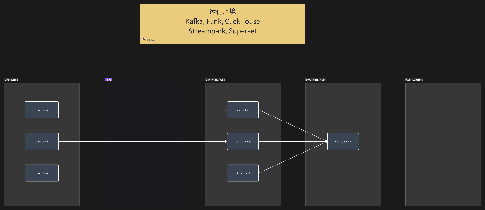

# BiliClaw

Bilibili 数据采集爬虫，支持多线程并发与令牌桶限流，数据实时写入 Kafka 供下游消费。

## 特性

- **多语言实现**：提供 Go 和 Python 两个版本
- **令牌桶限流**：多线程环境下的精确流量控制
- **管道化处理**：采集、解析、存储流水线解耦
- **Cookie 池**：支持多账号轮换，降低封禁风险
- **实时入仓**：数据直接写入 Kafka，支持流式处理

## 技术栈

| 组件 | 用途 |
|------|------|
| Go / Python | 爬虫核心实现 |
| Kafka | 消息队列 |
| Flink SQL | 实时 ETL |
| ClickHouse | 数据存储与分析 |

## 项目结构

```
BiliClaw/
├── spider-go/            # Go 版本爬虫
│   ├── api/              # Bilibili API 封装
│   ├── crawler/          # 爬虫核心逻辑
│   ├── cookie/           # Cookie 管理
│   ├── ratelimit/        # 令牌桶限流器
│   ├── storage/          # Kafka 存储
│   └── main.go           # 入口
├── spider-py/            # Python 版本爬虫
│   ├── api.py            # API 封装
│   ├── crawler.py        # 爬虫核心
│   ├── cookie_pool.py    # Cookie 池
│   ├── rate_limiter.py   # 限流器
│   ├── storage.py        # 存储层
│   └── main.py           # 入口
└── etl/                  # 数据处理
    ├── dim_*.flink.sql   # Flink SQL 维度表
    ├── dws_*.ch.sql      # ClickHouse 汇总表
    └── ddl_*.ch.sql      # ClickHouse DDL
```

## 快速开始

### Go 版本

```bash
cd spider-go
go build -o biliclaw
./biliclaw -config config.json
```

### Python 版本

```bash
cd spider-py
pip install -r requirements.txt
python main.py
```

## 配置说明

配置文件 `config.json` 示例：

```json
{
  "kafka_brokers": ["localhost:9092"],
  "rate_limit": 2.0,
  "rate_capacity": 5.0,
  "cookie_file": "cookies.txt"
}
```

## 架构图

> [飞书云文档](https://y1hmnem2vtl.feishu.cn/docx/Bh1KdAN1to3k4HxACeDcVBZPnBf?openbrd=1&doc_app_id=501&blockId=W48PdNy55oG7zwxXaTDcI988nih&blockType=whiteboard&blockToken=Jp53wCIvdhFX2Mb5bCWcaVXunad#W48PdNy55oG7zwxXaTDcI988nih)



## 看板预览


